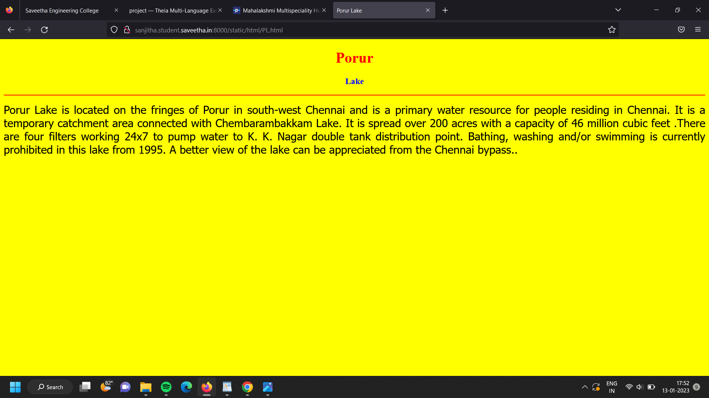

# Places Around Me
## AIM:
To develop a website to display details about the places around my house.

## Design Steps:

### Step 1:
Clone the github repository into Theia IDE.
### Step 2:
Create a new Django project

### Step 3:
write the needed HTML code.

### Step 4:
Run the Django server and execute the HTML files.

## Code:
```
map.html
<!DOCTYPE html>
<html lang="en">
<head>
<title>My City</title>
</head>
<body>
<h1 align="center">
<font color="red"><b>Porur</b></font>
</h1>
<h3 align="center">
<font color="blue"><b>Bolisetti Sanjitha(22000574)</b></font>
</h3>
<center>

<map name="MyCity">
<area shape="circle" coords="190,50,20" href="/static/html/PL.html" title="Porur Lake">
<area shape="rectangle" coords="230,30,260,60" href="/static/html/SRMC.html" title="Sri Ramachandra Hospitals">
<area shape="circle" coords="400,350,50" href="/static/html/MMS.html" title="Mahalakshmi Multispeciality Hospital">
<area shape="circle" coords="400,200,75" href="/static/html/bus.html" title="Iyyappanthangal bus Stand">
<area shape="rectangle" coords="490,150,870,320" href="/static/html/PTP.html" title="Porur Toll Plaza">
</map>
</center>
</body>
</html>

bus.html
<!DOCTYPE html>
<html lang="en">
<head>
<title> Iyyappanthangal Bus Stand</title>
</head>
<body bgcolor="cyan">
<h1 align="center">
<font color="red"><b>Porur</b></font>
</h1>
<h3 align="center">
<font color="blue"><b>Hi-Tech Bus Stand</b></font>
</h3>
<hr size="3" color="red">
<p align="justify">
<font face="Courier New" size="5">
<b> 
Chennai city bus route no 17M operated by MTC (Metropolitan Transport Corporation, Chennai). MTC is the company that operates the public bus service in Chennai and runs multiple number of city buses between Iyyappanthangal Bus Depot and Broadway Bus Terminal everyday..
</b>
</font>
</p>
</body>
</html>

PL.html
<!DOCTYPE html>
<html lang="en">
<head>
<title>Porur Lake</title>
</head>
<body bgcolor="yellow">
<h1 align="center">
<font color="red"><b>Porur</b></font>
</h1>
<h3 align="center">
<font color="blue"><b>Lake</b></font>
</h3>
<hr size="3" color="red">
<p align="justify">
<font face="Tahoma" size="5">
Porur Lake is located on the fringes of Porur in south-west Chennai and is a primary water resource for people residing in Chennai. It is a temporary catchment area connected with Chembarambakkam Lake. It is spread over 200 acres with a capacity of 46 million cubic feet .There are four filters working 24x7 to pump water to K. K. Nagar double tank distribution point. Bathing, washing and/or swimming is currently prohibited in this lake from 1995. A better view of the lake can be appreciated from the Chennai bypass..
</font>
</p>
</body>
</html>

SRMC.html
<!DOCTYPE html>
<html lang="en">
<head>
<title>Sri Ramachandra Hospitals
</title>
</head>
<body bgcolor="pink">
<h1 align="center">
<font color="red"><b>Porur</b></font>
</h1>
<h3 align="center">
<font color="blue"><b>SRMC
</b></font>
</h3>
<hr size="3" color="red">
<p align="justify">
<font face="Arial" size="5">
<b>
Sri Ramachandra Institute of Higher Education and Research (SRIHER), formerly Sri Ramachandra University (SRU), formerly Sri Ramachandra Medical College and Research Institute (SRMC & RI), is a private institute located in Porur, Chennai, India. SRIHER consists of nine constituent colleges and faculties with more than 6000 students. SRIHER was founded by Sri Ramachandra Education & Health Trust on September 11, 1985 by N. P. V. Ramasamy Udayar. It was founded as a medical college, and was awarded the deemed to be university status in September 1994. .
</b>
</font>
</p>
</body>
</html>

PTP.html
<!DOCTYPE html>
<html lang="en">
<head>
<title>Porur Toll Plaza</title>
</head>
<body bgcolor="lime">
<h1 align="center">
<font color="red"><b>Porur</b></font>
</h1>
<h3 align="center">
<font color="blue"><b>Toll Plaza</b></font>
</h3>
<hr size="3" color="red">
<p align="justify">
<font face="Georgia" size="5">
The toll plaza at Porur is one of two such facilities found on the 32-km-long four-lane Chennai Bypass. 
</font>
</p>
</body>
</html>

MMS.html
<!DOCTYPE html>
<html lang="en">
<head>
<title>Mahalakshmi Multispeciality Hospital</title>
</head>
<body bgcolor="orange">
<h1 align="center">
<font color="red"><b>Porur</b></font>
</h1>
<h3 align="center">
<font color="blue"><b>Hospital</b></font>
</h3>
<hr size="3" color="red">
<p align="justify">
<font face="Georgia" size="5">
Mahalakshmi Multispeciality Hospital, is one of the best, cost-effective modern clinical establishments in the Porur Iyyapanthangal, Poonamalle area which provides comprehensive 24 X 7 care. It provides all the benefits of a large hospital in a more patient-friendly and accessible setup</font>
</p>
</body>
</html>
```

## Output:




## HTML Validator


## Result:
The program for implementing image map is executed successfully